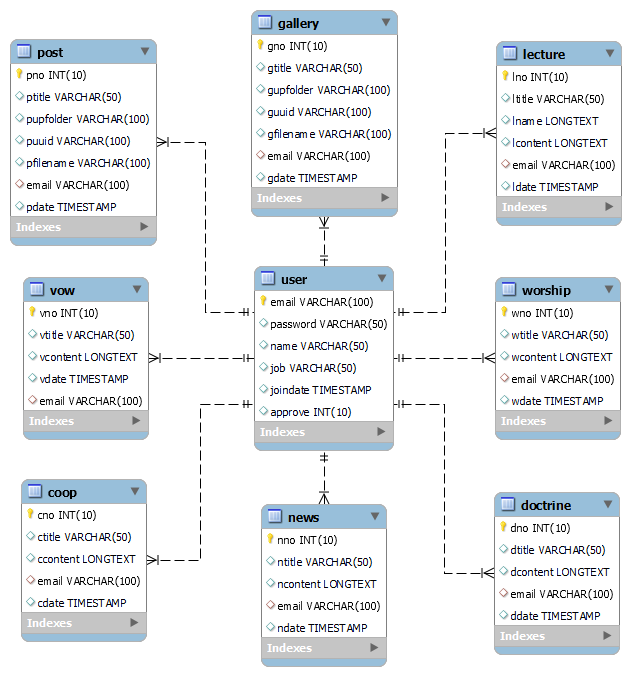
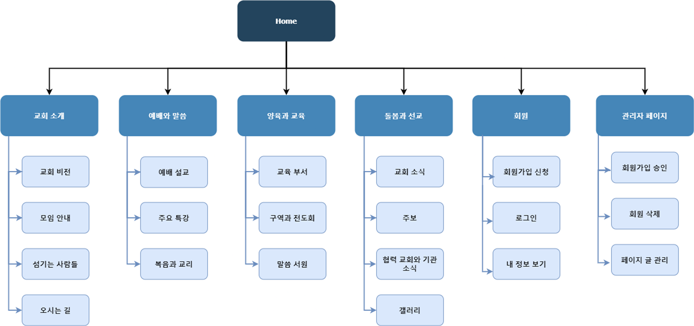

## 1. Introduction
행전우리교회 홈페이지입니다. 운영에 어려움이 있는 개척교회를 돕기 위해 봉사 목적으로 개발되었습니다.
 
링크 : http://actswoori.org

  

## 2. Tech Stack
- Backend : Java 8, Servlet 3.1, MyBatis 3.5
- Template engine : JSP 2.3
- Frontend : JavaScript, HTML, CSS
- RDBMS : MariaDB 10.0
- Git branching strategy : GitLab Flow
- Collaboration tool : Zoom, Notion, Google Workspace
- Deployment : Tomcat 8.5 (on CentOS 7)

  

## 3. ERD

  

## 4. IA

  

## 5. Description

### 사용자

- 사용자는 관리자, 회원, 비회원으로 구분됩니다.
- 인증과 인가는 높은 보안성을 가진 세션 기반 인증 방식으로 처리했습니다.
- 회원가입은 우측하단의 로그인 링크를 통해 가능합니다. 회원가입 신청 후 관리자가 가입 승인을 해야 회원가입이 완료됩니다.
- 비밀번호 찾기 시 이메일 인증 후 비밀번호를 재설정할 수 있습니다. 메일 발송은 Naver Mail SMTP Server를 통해 처리됩니다.

### 갤러리

- 다중 이미지 파일 업로드가 가능하도록 Apache Commons IO와 Apache Commons FileUpload를 사용했습니다.
- 썸네일을 보기 쉽게 표시하기 위해 Bootstrap을 사용했습니다.
- 게시물 표시 개수 조정, 여러 옵션에 대한 검색, 페이징을 동시에 처리할 수 있도록 Mybatis 동적 쿼리를 활용했습니다.
- 자세히 보기 시 원본 이미지를 볼 수 있게 하기 위해 Lightbox를 사용했습니다. 썸네일 클릭 시 자세히 보기가 가능합니다.

### 주보

- PDF 파일 업로드, 다운로드, 열람이 가능합니다. 다운로드와 열람을 편리하게 할 수 있도록 PDF.js와 iframe을 사용했습니다.
- 게시물 표시 개수 조정, 여러 옵션에 대한 검색, 페이징을 동시에 처리할 수 있도록 Mybatis 동적 쿼리를 활용했습니다.

### 일반 게시판

- 예배 설교, 주요 특강, 복음과 교리, 말씀 서원, 교회 소식, 협력 교회와 기관 소식이 있습니다.
- 게시글 작성의 편의성을 높이기 위해 Summernote를 활용했습니다.
- 게시물 표시 개수 조정, 여러 옵션에 대한 검색, 페이징을 동시에 처리할 수 있도록 Mybatis 동적 쿼리를 활용했습니다.

### 오시는 길

- 교회 위치는 Kakao Map API를 통해 표시됩니다. 정확한 위치를 쉽게 파악할 수 있도록 로드뷰 보기 기능을 넣었습니다.

  

## 6. 운영 중 발생한 문제

　운영 중 서버의 용량이 가득 차는 상황이 발생했었고 원인을 살펴본 결과 10MB 이상의 이미지 파일들이 다수 업로드되어 있는 것을 발견했습니다. 규모가 작은 사이트이므로 용량이 작은 서버를 이용 중이지만 서버를 키우는 것보단 파일 용량을 줄이는 것이 더 우선이라고 판단했습니다.
 
　이미지 파일 업로드 시 5MB 이상의 파일은 올릴 수 없도록 처리했고 기존의 파일들은 압축 후 교체해 주었습니다. 기존에 업로드되어 있던 이미지 파일들이 전부 JPEG 파일이었기 때문에 기존의 이미지 파일 중에 용량이 애초에 크지 않은 파일은 압축이 많이 되지 않도록 하여 기존의 이미지들을 보는 데에는 영향이 없도록 했습니다. 결과적으로 여유 공간은 1.5%에서 41%로 늘렸고 해결 방식에서의 사이드 이펙트는 최소화할 수 있었습니다.
